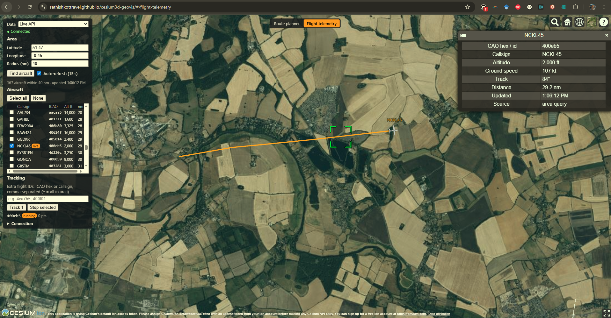

# aviation-telemetry-service



Backend for an aviation flight-tracking demo: live aircraft positions over GraphQL subscriptions, plus stored history
for playback. The frontend is **[cesium3d-geovis](https://github.com/sathishkottravel/cesium3d-geovis#cesium3d-geovis)**,
a CesiumJS map running on [GitHub Pages](https://sathishkottravel.github.io/cesium3d-geovis/#/flight-telemetry).

## How it works


- **adsb-producer** polls [ADSB.lol](https://api.adsb.lol) for one area and publishes the tracked aircraft to RabbitMQ.
- **telemetry-worker** validates each position, stores it in MongoDB and publishes it as a live update.
- **api-service** serves GraphQL: flights, routes, history (`telemetryHistory`) and live positions (`liveTelemetry`).

A one-page summary is in [docs/system-overview.md](docs/system-overview.md).

## Repository

| Folder | What it is |
| ------ | ---------- |
| `api-service/` | FastAPI + Strawberry GraphQL: queries, the `liveTelemetry` subscription, telemetry ingest, `/health/all` |
| `telemetry-worker/` | RabbitMQ consumer: normalizes telemetry, stores it in MongoDB, publishes live updates |
| `adsb-producer/` | FastAPI service that polls ADSB.lol and owns live tracking (start/stop over HTTP) |
| `shared/` | Settings, models, MongoDB and RabbitMQ helpers, the ADS-B client, tracing |
| `deploy/` | Render guide, Caddy + Jaeger infra, optional self-hosted Docker setup |

## Quick start

```sh
docker compose up --build
```

- GraphQL and GraphiQL: http://localhost:8000/graphql
- ADS-B producer: http://localhost:8001/docs
- Jaeger: http://localhost:16686

Then load demo data with `docker compose run --rm worker seed-db` and run `query { airports { icao name } }` in
GraphiQL. Running without Docker, tests and more: [docs/development.md](docs/development.md).

## Documentation

| Document | Contents |
| -------- | -------- |
| [docs/development.md](docs/development.md) | Run with Docker or uv, seed data, try it, tests, message flow, MongoDB collections, retention |
| [docs/api.md](docs/api.md) | GraphQL and REST reference, authentication, CORS, live ADS-B tracking |
| [docs/deployment.md](docs/deployment.md) | Render, the DigitalOcean droplet (Caddy + Jaeger), self-hosting, tracing |

## Deployment

| Part | Where |
| ---- | ----- |
| Frontend ([cesium3d-geovis](https://github.com/sathishkottravel/cesium3d-geovis#cesium3d-geovis)) | GitHub Pages |
| api, producer, worker | Render free tier ([guide](deploy/render/README.md)) |
| Caddy + Jaeger | DigitalOcean droplet ([guide](deploy/infra/README.md)) |
| MongoDB, RabbitMQ, ADS-B data | MongoDB Atlas, CloudAMQP, ADSB.lol |

## Status

A demo, still growing. Next: richer telemetry normalization and optional ML anomaly scoring.
