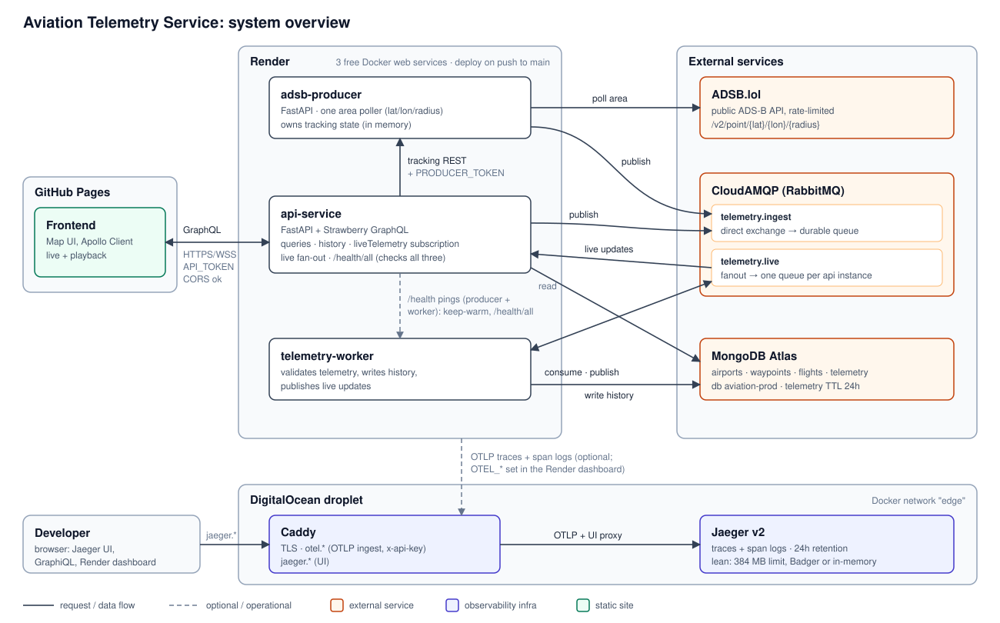

# System overview

## Purpose
A flight-tracking demo: live aircraft positions on a map, plus stored history for playback.

## Frontend
A map UI ([cesium3d-geovis](https://github.com/sathishkottravel/cesium3d-geovis#cesium3d-geovis)) on GitHub Pages, using Apollo Client over GraphQL (HTTPS for queries, WebSocket for live updates).
Its origin (`https://sathishkottravel.github.io`) is allowed by CORS (`CORS_ORIGINS`) on all three services.

## Services
- **api-service:** FastAPI + GraphQL. Serves flights, routes, history and the `liveTelemetry` subscription.
- **adsb-producer:** polls ADSB.lol for one area (latitude/longitude/radius) and publishes the tracked aircraft.
- **telemetry-worker:** validates telemetry, stores it in MongoDB and forwards live updates.

## Data flow
Producer (or `POST /api/telemetry`) → RabbitMQ `telemetry.ingest` → worker → MongoDB.
The worker also publishes to `telemetry.live`, and each api instance pushes it to its GraphQL subscribers.

## Storage
MongoDB Atlas: airports, waypoints, flights and telemetry. Telemetry expires after 24 hours.

## Live and playback
`liveTelemetry` streams the latest positions; `telemetryHistory` returns stored positions for a time range.
Both use the same telemetry model, so the frontend renders them the same way.

## Deployment
Render runs the three services as free web services, deployed on every push to `main`.
A DigitalOcean droplet runs Caddy and Jaeger; ADSB.lol, CloudAMQP and MongoDB Atlas are external.

## Security
`API_TOKEN` protects GraphQL and ingest, `PRODUCER_TOKEN` protects the producer, and `ADMIN_TOKEN` protects deletes.
All secrets live in the Render dashboard, never in the repository.

## Health
Each service answers `GET /health`; `GET /health/all` on the api checks all three in one call (ok / degraded).

## Observability
Optional OpenTelemetry traces, including log lines, go through Caddy to Jaeger on the droplet (kept for 24 hours).
